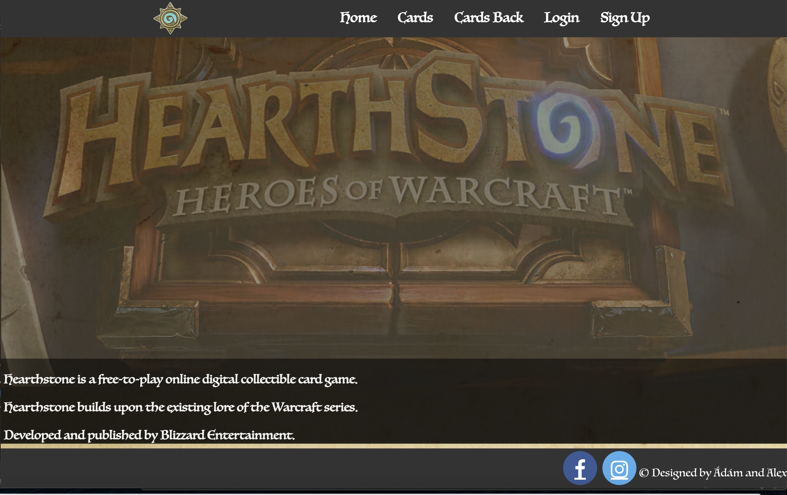

# HeartStone Frontend

This repository shows us the front-end part of the 
Hearth Stone project written in React. 

## Basic Information
In HeartStone every character are derived from the World of Warcraft in 
the forms of cards. In this website you are able to discover these cards 
and see relevant information about the characters.

## Relevant information
In order to get all the contents, the back-end of the projects needs to be installed
as well. It is available on https://github.com/alexseres/BackEnd.

##Install 
Clone down this repository. You will need `node` and `npm` installed globally on your machine.  

`npm install`  

To Run Test Suite:  

`npm test`  

To Start Server:

`npm start`  

To Visit App:

`localhost:3000/`  

## Contributing
Pull requests are welcome. For major changes, please open an issue first to discuss what you would like to change.

Please make sure to update tests as appropriate.

